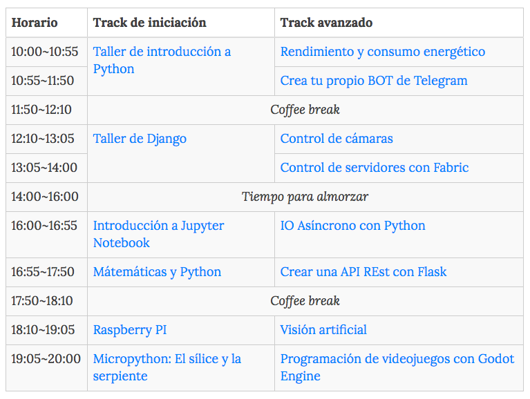
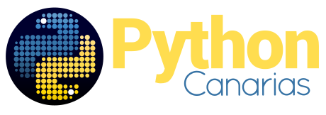

# Notas de la cuarta reunión para organización del PyDay

Asistentes: Hector (@m0n0b0t),  Juan Ignacio (@Euribates), Sergio (@sdelquin) y Alberto(@amd77).

+ Fecha: 9/2/2017  
+ Lugar: Hangar Kreitek  
+ Menú: pizza (cerveza y jugos)
+ Otros asistentes cercanos: Robot Roomba

## Temporalización de la jornada

Se acordó que las charlas fueran de 40 minutos + 10 minutos de preguntas + 5 minutos de margen = 55 minutos por *slot*. Habrán dos *breaks* de 20 minutos, tanto en la mañana como en la tarde, y el almuerzo será de 2 horas. Con todo esto, la temporalización de la jornada del `#pyDayTF`  quedaría de la siguiente forma:

## Evaluación de la actividad

**1 crédito ECTS** = 10h (clase) + 5h (trabajo personal) = **15h**

Dado que el evento tiene una duración de 8h, será necesario establecer un sistema de evaluación adicional de trabajo personal del alumnado, que permita cubrir las 7h que faltan hasta las 15h del crédito ECTS.

Se decide que esta evaluación se realizará a través de un *examen*. Por lo tanto, cada ponente deberá preparar un *examen* con contenidos relacionados con su charla. Este **examen** se llevará **impreso** al #PyDay17.

Aquel alumnado interesado en obtener 1 crédito ECTS deberá cumplir los siguientes requisitos:

1. Asistir a **8h** de charlas/talleres.
2. Entregar y aprobar, como mínimo, **3 exámenes** sobre diferentes charlas/talleres a los que haya asistido.

## Almuerzo

Se decide que el almuerzo **no correrá a cargo de la organización**, sino que cada participante buscará el sitio que le interese para comer. Existen varias opciones en la zonas aledañas a las salas de ordenadores del campus de Anchieta.

## Registro de participantes

Sería interesante si `Ticketea` permitiera subir archivos adjuntos, tipo CV, y además si permitiera poner recordatorios para confirmar asistencia, cerrar fechas de preinscripción o tener lista de participantes en reserva.

Lo de los archivos adjuntos no es imprescindible, pero las otras cuestiones sí. En caso de que `Ticketea` no dispusiera de ellas, habría que plantearse montar algo en Django Forms.

## Pack de los asistentes (Welcome Pack)

- Por parte de la organización:
    + Bolsa.
    + Acreditaciones con blister.
    + Pegatinas con el logo de Python Canarias.
    + Flyer con el programa.
    + Número para sorteo.
    + Usuario y contraseña para acceso a la red de la ULL.
- Por parte de los patrocinadores: (de momento)
    + Mutua Tinerfeña:
        * Bolígrafos.
        * Bloc de notas.

Se descarta la compra de pendrives y camisas serigrafiados por su elevado coste. Se podría replantear esta decisión en caso de conseguir más patrocinadores.

## Gestión económica

Se decide crear la dirección de correo electrónico `patrocinio@pythoncanarias.es` para todas las cuestiones relativas a los *sponsors*. Esta cuenta estará redirigida a Héctor (@monobot).

Se decide crear una **hoja de cálculo en Google Drive** para llevar la contabilidad del evento. Básicamente, llevar ingresos y gastos. En dicha hoja se llevará un registro de patrocinios y cantidad aportada. La hoja de cálculo tendrá permisos de:

- **Escritura** para **Héctor** (@monobot) y **Víctor** (@zerasul).
- Lectura para todos los miembros del canal privado de la organización ( Telegram).

Para el recibí del dinero de los patrocinadores se utilizarán **facturas cruzadas**. En caso de que esto genere problemas para algún sponsor, se plantea la posibilidad del dinero adelantado por parte de miembros de la organización.

## Difusión

Se utilizarán 1 ó 2 *roll-ups* cedidos por imprenta y/o Café Teatro Siete. Habrá que imprimir la(s) lámina(s) para dichos roll-ups.

Juan Ignacio (@Euribates) cerrará el flyer para patrocinio con el nuevo correo y la posibilidad de aportar al *Welcome Pack*.

## Premios

Al final de la jornada, habrá un sorteo con el número que se dejará en las bolsas de los participantes.

Los posibles regalos, de momento, son los siguientes:

- Raspberry PI cedida por el [Colegio Profesional de Ingenieros Técnicos en Informática de Canarias](https://www.coitic.es/).
- 4 suscripciones de 3 meses para [Kreitek](http://kreitek.org/).

Hay posibilidad de conseguir libros de *Starchpress* vía Víctor (@Zerasul) más los regalos que puedan ir donando los patrocinadores.

## Logo de Python Canarias

Se decide por mayoría elegir el **logo de los puntos** como logo para *Python Canarias*.

El diseño es mérito de Juan Ignacio (@Euribates)

## Grabación en vídeo de las charlas

Se decide no emitir las charlas en directo y invertir esfuerzos en la correcta grabación de las mismas, para una posterior post-producción y publicación, que pudiera llegar a un público más amplio, mejorando la calidad audiovisual y captando más atención.

Sergio (@sdelquin) creará una cuenta de Youtube para *Python Canarias*.

Se decide montar la siguiente tecnología de grabación:

- Cámara digital enfocando al ponente.
- GoPro enfocando al público.
- Grabador HDMI para capturar la pantalla del ponente.

Alberto (@amd77) se ofrece a traer, al menos, uno de cada. En el caso de tuviéramos 2 de cada, podríamos grabar completamente los dos tracks.

## Fechas importantes

- **13 de febrero**: comienzo de la difusión.
- **Del 1 de marzo al 7 de marzo**: confirmación de asistencia.
- **7 de marzo**: cierre de la inscripción web.
- **8 de marzo**: pasar lista de asistentes al servicio TIC de la ULL para que cree las cuentas de usuario de acceso a la red.

## Recursos humanos

Contamos con las siguientes personas, como fijas, para ayudar el día del `#pyDayTF`:

- Héctor.
- Alberto.
- Juan Ignacio.
- Sergio.
- Víctor.
- Lucas.
- Héctor (Kreitek).
- Jesús OSL.
- Diego.

Como dudosos, se establecen las siguientes personas:

- David.
- Sergio Medina.
- Sergio IAC.
- Tomás.
- Elena.

Se acuerda crear una sección en la web tipo `Call for volunteers`, para que aquellas personas que quieran colaborar se puedan poner en contacto con la organización.

## Nota de prensa

De momento, lo que hay escrito es lo que Alberto (@amd77) ha dejado en el Etherpad de la organización:

> El día 11 de Marzo se celebrará el evento "pyDay Tenerife 2017" organizado por el grupo de usuarios de Python de Canarias y por la Oficina del Software Libre de la Universidad de la Laguna. El evento se celebrará desde las 10:00 hasta las 20:00 y constará de charlas y talleres, tanto introductorios como avanzados, bien para el público en general como para el universitario. Para estos últimos existe la posibilidad de convalidar la asistencia por un crédito ECTS. Entre los dos eventos hay un límite de 60 plazas. El evento es gratuito.  Haz tu inscripción cuanto antes.

> Referencias:

> Grupo de usuarios de Python de Canarias http://pythoncanarias.es
> Oficina del Software Libre de la Universidad de la Laguna http://www.osl.ull.es
> Detalles del curso, programa, inscripción etc: http://pythoncanarias.es/pyday-2017/

> Información sobre el lenguaje python: ...

Necesitamos contactos para hacerlo llegar a medios de comunicación.

## Web de pyDayTF

Se decide sacar el **mapa** y el **programa** a sendas páginas, y quitarlos de la página de inicio.

Se decide cambiar la url a: `pythoncanarias.es/pyday`

Se decide incorporar algunos *off-topics* que hay en la página de inicio a la sección de *FAQ* para darle contenido.

Se decide añadir una sección de enlaces, con aquellas cuestiones relevantes que pudieran llegar al grupo de *Telegram* de *Python Canarias*.

## Fin

Se levanta la sesión siendo las 21:10h
