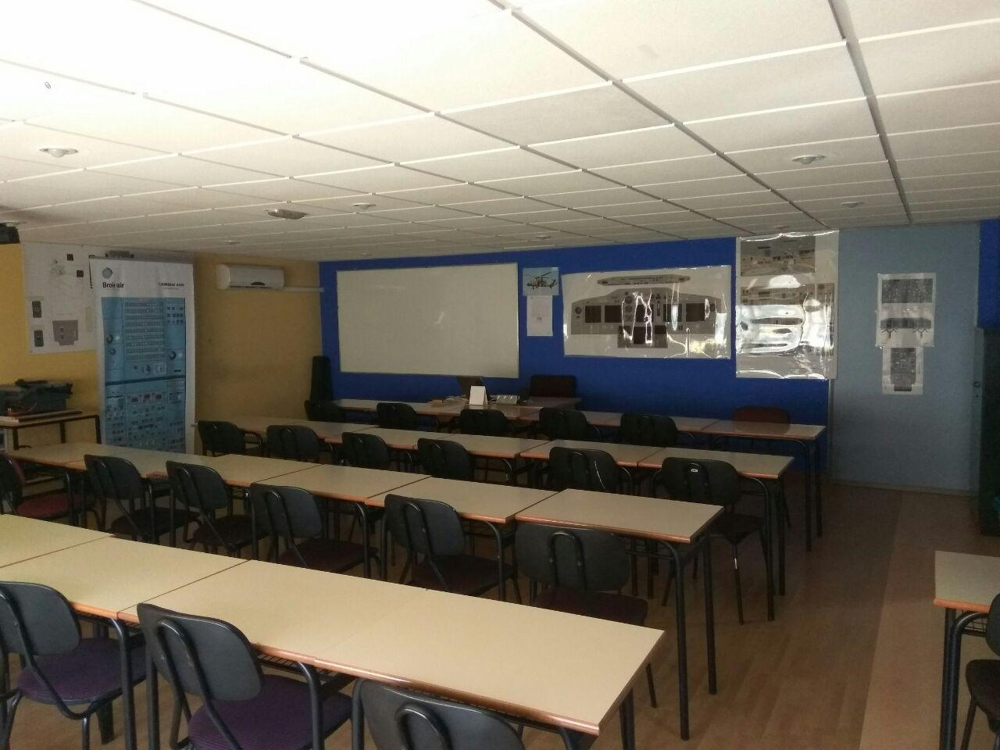
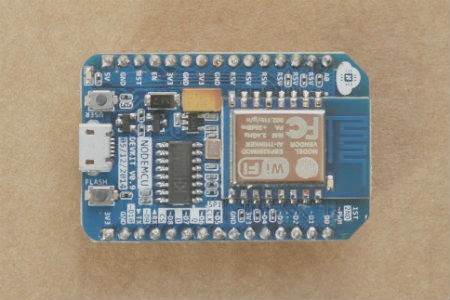

# Segunda reunión de preparación del curso `micropython`

## Asistentes

- Héctor (`@m0n0b0t`)
- Juan Ignacio (`@Euribates`)
- Sergio (`@sdelquin`)
- Lucas (`@enenNN`)
- Víctor (`@zerasul`)
- Alberto (`@amd77`)
- Javier (`@Javiericu`)

## Lugar y hora

- Kreitek
- 17 de julio de 2017
- 18:00h

# Acuerdos sobre el curso

- La entrada para el curso se venderá directamente en [K-Electrónica](http://k-electronica.es/).
- Su precio será el del "kit" + el margen de ganancia para K-Electrónica.
- Se confirma el lugar del curso:
> [CETAC](http://brok-air.com/cetac/)  
> Ctra. Gral. del Norte C-820  
> Edif. STAR, nave 2  
> 38297 - La Laguna  
> Tenerife (España)  

En colaboración con [Brok-air Aviation Group](http://brok-air.com/). Agradecemos a **Javier** su predisposición para la búsqueda del lugar para el curso.

- El aula cuenta con proyector, altavoces y, con suerte, aire acondicionado:

- Se confirma que el curso de `Micropython` será el sábado **30 de septiembre** con 4h de duración:
> 9:30 - 11:30: Primera sesión  
> 11:30 - 12:00: Coffee-break (hay un McDonalds muy cerca)  
> 12:00 - 14:00: Segunda sesión

- La difusión del curso se hará a través del blog de la web de *PythonCanarias* `http://pythoncanarias.es/`.

- Las entradas se harán en formato A5 tipo flyer. Contendrá información sobre fecha, hora y lugar del curso, además del contenido del "kit" y precio de la entrada. Las entradas se harán llegar a K-Electrónica para su venta. El encargado de la confección de las entradas es **Héctor**.

## Propuesta de proyecto para el curso

A falta de confirmar por parte de **Lucas**, ya que en este momento de la reunión estaba ausente, los asistentes propusimos desarrollar un *"sensor de proximidad"*, de manera que a medida que nos acercamos al sensor se emita un sonido cada vez con mayor frecuencia además de una "hilera" de leds que se irían enciendo de manera progresiva.

### Contenido del kit

- Protoboard (pequeña).
- [NodeMCU](http://nodemcu.com/) (placa de desarrollo basada en el microcontrolador `ESP8266`).

- 20 cables macho-macho.
- 5 leds.
- 5 resistencias (en el entorno de los 330 ohmios).
- Cable MicroUSB-USB de datos.
- Potenciómetro.
- Fotodiodo.
- Sensor de ultrasonidos.
- Buzzer.

### Drivers para el desarrollo con NodeMCU

#### Windows

[nodemcu-devkit](https://github.com/nodemcu/nodemcu-devkit/tree/master/Drivers)  
[cityos-air](https://cityos-air.readme.io/v1.0/docs/windows-os-installation)

#### Mac OSX

[nodemcu-devkit](https://github.com/nodemcu/nodemcu-devkit/tree/master/Drivers)  
[cityos-air](https://cityos-air.readme.io/v1.0/docs/installations)
